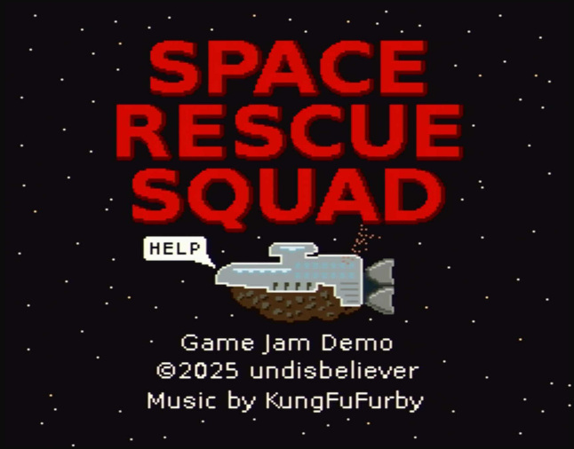

Space Rescue Squad
==================

A simple platformer game for the [2025 SNESDEV game jam](https://itch.io/jam/snesdev-2025).

Oh No!  Disaster has befallen a *Guild of Mad Scientists* research station.
Can the rescue squad (armed with their trusty stun weapons) save the crew from certain peril?

Controls
========
 * **B** jump
 * **Y** run
 * **A** melee attack
 * **X** shoot
 * **Up** enter doors
 * **Select** pause
 * **Select**, then **Select** - restart room

License
=======

All engine code and game code is licensed under the [zlib license](LICENSE).

This project uses the [Terrific Audio Driver](https://github.com/undisbeliever/terrific-audio-driver)
which is licensed under the zlib license.

The game's resources (everything in the `game/resources` directory) are intended for only this game
and are not to be used in other projects.

 * Music by KungFuFurby
 * Sound effects by undisbeliever and KungFuFurby
 * Aseprite and PNG files for sprites, palettes, images and tiles
 * untech-editor files
 * Rooms and levels

Build Requirements
===================
 * [my private fork of bass](https://github.com/undisbeliever/bass-untech)
   (included as a git submodule)
 * [untech-editor](https://github.com/undisbeliever/untech-editor)
   (included as a git submodule)
 * [Terrific Audio Driver](https://github.com/undisbeliever/terrific-audio-driver)
   (included as a git submodule)
 * python3
 * gnu Make

